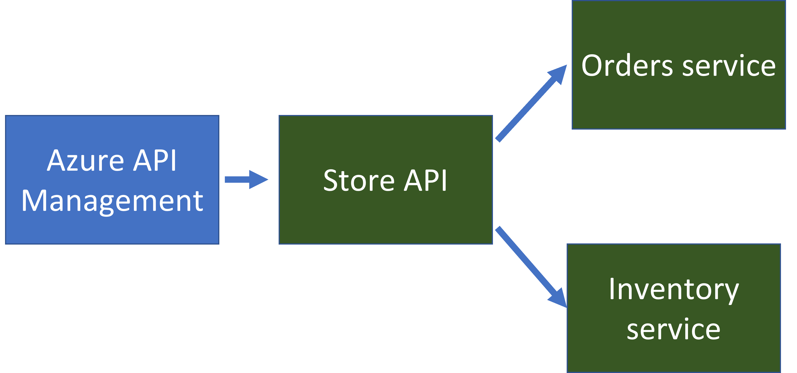

# Container Apps Store Microservice Sample

This repository was created to help users deploy a microservice-based sample application to Azure Container Apps.

Azure Container Apps is a managed serverless container offering for building and deploying modern apps at scale. It enables developers to deploy containerized apps without managing container orchestration. This sample makes use of the Distributed Application Runtime (Dapr), which is integrated deeply into the container apps platform. 

Dapr is a CNCF project that helps developers overcome the inherent challenges presented by distributed applications, such as state management and service invocation. Container Apps also provides a fully-managed integration with the Kubernetes Event Driven Autoscaler (KEDA). KEDA allows your containers to autoscale based on incoming events from external services such Azure Service Bus or Redis.

## Solution Overview

There are three main microservices in the solution.

#### Store API (`node-app`)

The [`node-app`](./node-service) is an express.js API that exposes three endpoints. `/` will return the primary index page, `/order` will return details on an order (retrieved from the **order service**), and `/inventory` will return details on an inventory item (retrieved from the **inventory service**).

#### Order Service (`python-app`)

The [`python-app`](./python-service) is a Python flask app that will retrieve and store the state of orders. It uses [Dapr state management](https://docs.dapr.io/developing-applications/building-blocks/state-management/state-management-overview/) to store the state of the orders. When deployed in Container Apps, Dapr is configured to point to an Azure Cosmos DB to back the state.

#### Inventory Service (`go-app`)

The [`go-app`](./go-service) is a Go mux app that will retrieve and store the state of inventory. For this sample, the mux app just returns back a static value.

## Deploy via GitHub Actions 

> **IMPORTANT NOTE**: This tutorial has been updated (8/2022) to use GITHUB.TOKEN instead of a GH PAT (Personal Access Token). If you have run this tutorial already, and have images that were pushed using a PAT, you will need to delete these from GHCR for the workflow to successfully write the updated images.

The entire solution is configured with [GitHub Actions](https://github.com/features/actions) and [Bicep](https://docs.microsoft.com/azure/azure-resource-manager/bicep/overview) for CI/CD
1. Fork the sample repo
2. Create the following required [encrypted secrets](https://docs.github.com/en/actions/security-guides/encrypted-secrets#creating-encrypted-secrets-for-a-repository) for the sample

| Name              | Value                                                                                                                                                                                                                                                                                                   |
| ----------------- | ------------------------------------------------------------------------------------------------------------------------------------------------------------------------------------------------------------------------------------------------------------------------------------------------------- |
| AZURE_CREDENTIALS | The JSON credentials for an Azure subscription. Make sure the Service Principal has permissions at the subscription level scope [Learn more](https://docs.microsoft.com/azure/developer/github/connect-from-azure?tabs=azure-portal%2Cwindows#create-a-service-principal-and-add-it-as-a-github-secret) |
| RESOURCE_GROUP | The name of the resource group to create|

3. Open GitHub Actions, select the **Build and Deploy** action and choose to run the workflow. If you would like to deploy the sample with API Management, you can update the `deployApim` parameter to `true` in the `.github/workflows/build-and-deploy.yaml`.

   The GitHub action performs the following actions:
   
   - Build the code and container image for each microservice
   - Push the images to your private GitHub Container Registry using the `GITHUB.TOKEN`
   - Create an Azure Container Apps environment with an associated Log Analytics workspace and App Insights instance for Dapr distributed tracing
   - Create a Cosmos DB database and associated Dapr component for using Cosmos DB as a state store
   - Create an API Management instance to frontend the node-app API endpoints **(optional)**
   - Deploy Container Apps for each of the microservices

4. Once the GitHub Actions have completed successfully, navigate to the [Azure Portal](https://portal.azure.com) and select the resource group you created. Open the `node-app` container, and browse to the URL. You should see the sample application running. You can go through the UX to create an order through the order microservice, and then navigate to the `/orders?id=foo` endpoint and `/inventory?id=foo` to get the status via other microservices.

5. After calling each microservice, you can open the application insights resource created and select the **Application Map**, you should see a visualization of your calls between Container Apps (note: it may take a few minutes for the app insights data to ingest and process into the app map view).

## Build and Run

[Click here for instructions on building and running the application locally](build-and-run.md)

